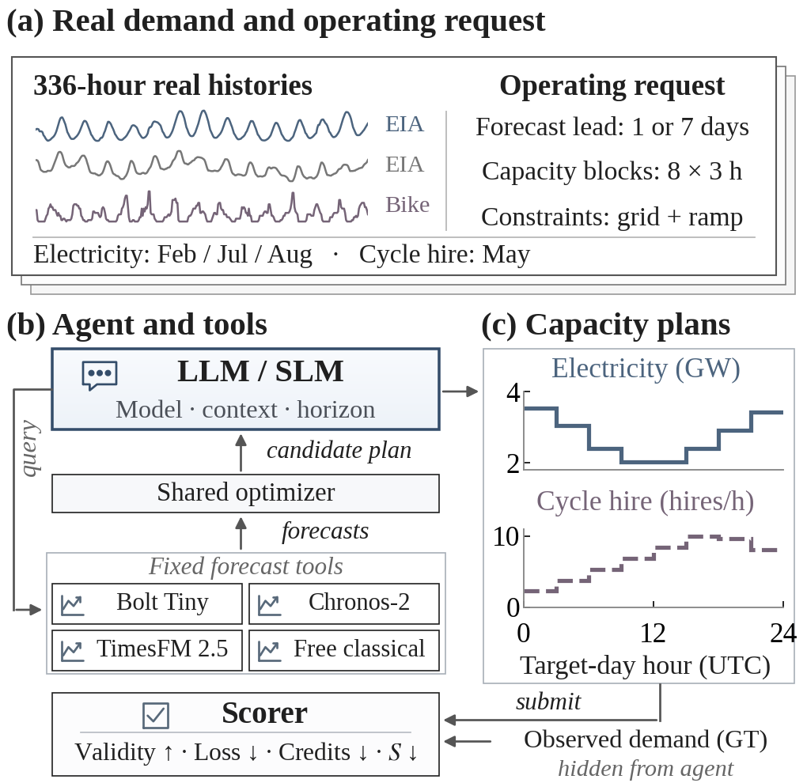
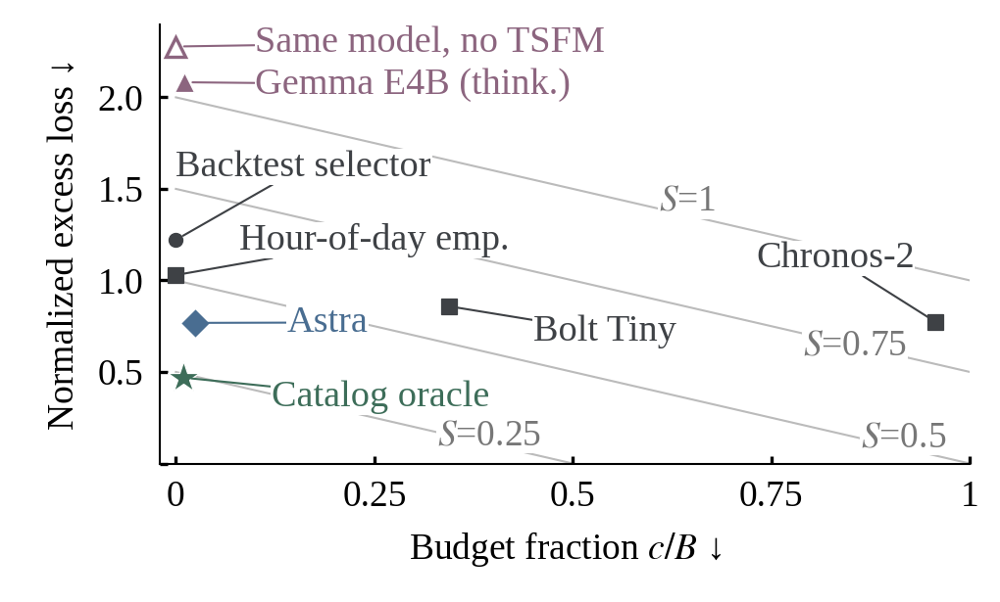
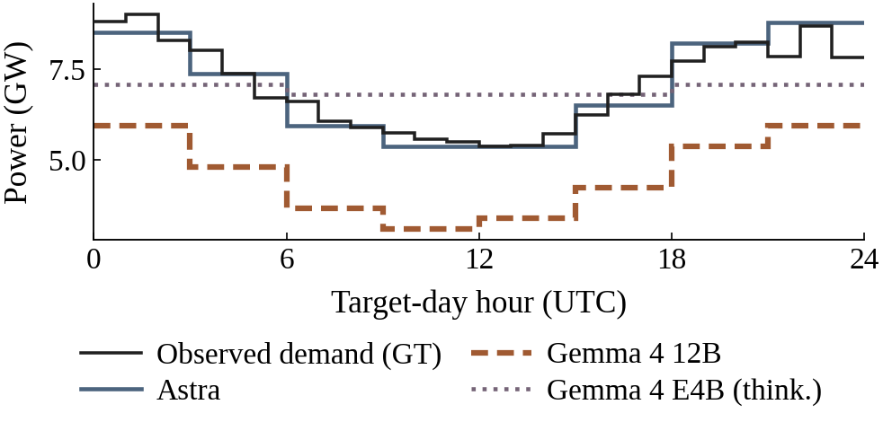

# Forecast Workflow Bench (FWBench)

[](https://huggingface.co/datasets/Neurogica/forecast-workflow-bench)
[](https://huggingface.co/spaces/Neurogica/forecast-workflow-bench-leaderboard)
[](pyproject.toml)
[](docs/docker.md)
[](LICENSE)

**From forecasting to decisions: evaluating how LLMs and SLMs use time-series forecasting tools.**

FWBench evaluates language models that select forecast models, histories and
horizons, then submit constrained capacity plans. Fixed forecasting services and
a shared loss–cost objective measure whether agents use predictions effectively.
The benchmark covers **1,251 electricity and cycle-hire cases**, including
**two hosted and eight local model configurations**.

<p align="center">
  
  <br><em>FWBench evaluates the language model; forecasting models are fixed tools.</em>
</p>

[Getting started](#-getting-started) · [Results](#-results) · [Dataset](#-dataset) · [Leaderboard](#-leaderboard) · [Citation](#-citation)

## 📖 Abstract

<details>
<summary>Read the manuscript abstract</summary>

Time-series foundation models (TSFMs) provide forecasts for operational decisions,
but accuracy alone does not determine their value. Evaluating agents that use these
models requires measuring decision quality and forecast cost. FWBench evaluates
this capability on 1,251 electricity and cycle-hire cases using fixed forecast
tools and simulated capacity contracts. Agents select models, histories and
horizons, then submit capacities to minimize a stated loss–cost objective. We
evaluated two hosted and eight local configurations, including small language
models, and tested local models with and without TSFMs. GPT-6 Astra bought
inexpensive short-horizon forecasts selectively, using 2.5% of the budget, and
outperformed fixed policies when the saved decisions were scored with three
loss–cost weightings. TSFM access worsened the combined loss–cost score for two
local configurations. Thinking improved this score for three local models but
worsened it for one. Access to forecast tools did not ensure effective decisions.

</details>

## ✨ Benchmark at a glance

- **Two domains:** 1,091 electricity cases across three seasonal cohorts and 160 cycle-hire cases.
- **Fixed forecasting tools:** Chronos-Bolt Tiny, Chronos-2 and TimesFM 2.5, alongside free classical plans.
- **Operational decisions:** eight three-hour capacities must satisfy grid and ramp constraints.
- **Explicit objective:** agents are instructed to balance decision loss and forecast expenditure.
- **Local decision-making:** open-weight SLMs are evaluated with thinking on/off and with/without TSFMs.

The **Language Model track** fixes the harness, prompts, tools and scoring. Each
case allows **113,726 forecast credits and 12 tool calls**. Credits measure
forecast-service expenditure, not language-model API prices or total runtime.
SLMs have fewer than 10B total parameters; larger local models have at least 10B.

The ranking minimizes **S = 0.5 × (normalized excess decision loss + budget fraction)**.
The loss term subtracts the minimum feasible loss with known demand and divides
by a pre-evaluation domain scale. Invalid submissions retain their penalties.
Electricity and cycle hire each receive half of the aggregate weight.
[Full evaluation protocol](docs/objective_protocol.md)

## 🏆 Results

<details open>
<summary>Language-model configurations and forecasting references</summary>

| Configuration | Valid ↑ | Loss ↓ | Forecast credits ↓ | S ↓ |
|:--|--:|--:|--:|--:|
| *Small language models (SLMs)* | | | | |
| Gemma 4 E4B | 1,019/1,251 | 0.7074 | 74.1 | 4.6294 |
| Qwen3 4B | 1,242/1,251 | 0.7175 | 0.0 | 4.5478 |
| Qwen3 4B (thinking) | 1,237/1,251 | 0.5196 | 0.0 | 2.5232 |
| Gemma 4 E4B (thinking) | 1,251/1,251 | 0.3649 | 1,209.0 | 1.0465 |
| *Larger local language models* | | | | |
| Qwen3.6 35B-A3B | 3/1,251 | 2.0080 | 1,176.3 | 17.9773 |
| Qwen3.6 35B-A3B (thinking) | 160/1,251 | 1.8533 | 1,464.2 | 16.4632 |
| Gemma 4 12B (thinking) | 490/1,251 | 1.2837 | 58,103.6 | 10.6358 |
| Gemma 4 12B | 766/1,251 | 0.9611 | 46,091.1 | 7.3281 |
| *Large language models (LLMs)* | | | | |
| GPT-5.4 nano | 1,139/1,251 | 0.5160 | 2,885.6 | 2.6411 |
| GPT-6 Astra | 1,251/1,251 | 0.3044 | 2,801.7 | 0.3964 |
| *Forecasting references (outside agent ranking)* | | | | |
| Hour-of-day empirical | 1,251/1,251 | 0.3165 | 0.0 | 0.5147 |
| Fixed Chronos-Bolt Tiny | 1,251/1,251 | 0.3087 | 39,100.4 | 0.6014 |
| Fixed Chronos-2 | 1,251/1,251 | 0.3050 | 108,782.9 | 0.8651 |

Thinking denotes the enabled mode; other local rows use thinking off. All rows
cover the same 1,251 cases. Metrics use domain-balanced aggregation and credits
are mean per-case expenditure, not totals. Reference policies are not agents.

[Complete aggregates and ablation studies](https://huggingface.co/datasets/Neurogica/forecast-workflow-bench/blob/main/results/summary.json) ·
[Interactive leaderboard](https://huggingface.co/spaces/Neurogica/forecast-workflow-bench-leaderboard)

</details>

Astra achieved similar decision loss to fixed Chronos-2 at lower forecast cost.
The best SLM returned valid plans on every case but scored worse than the free
hour-of-day policy. TSFM access and thinking did not consistently improve local
results, making forecast use and capacity selection important evaluation targets.

<p align="center">
  
  <br><em>Lower left is better. Diagonals indicate equal S; the star is the hindsight catalog oracle.</em>
</p>

### Qualitative example

<p align="center">
  
  <br><em>One-day-ahead SRP example, July 25: observed demand and agent capacity plans.</em>
</p>

## 🛠️ Getting started

### Installation

```bash
git clone https://github.com/Neurogica/forecast-workflow-bench.git
cd forecast-workflow-bench
uv sync --locked --python 3.11 --extra dev
uv run --no-sync fwb --help
uv run --no-sync fwb results --input leaderboard/results.json
```

### Docker

```bash
docker build -t fwbench .
docker run --rm --network none fwbench results --input leaderboard/results.json

# Offline tests; no model downloads or paid calls during test execution.
docker build --target test -t fwbench-test .
docker run --rm --network none fwbench-test
```

The image pins Python by digest and dependencies through `uv.lock`. It contains
the core harness and scorer; the dataset, model weights and forecasting backends
are installed separately. [Docker and reproducibility](docs/docker.md)

### Run an agent

After downloading the dataset and installing the pinned forecasting backends,
point the local adapter at an OpenAI-compatible model server:

```bash
uv run --no-sync fwb run --provider local --model YOUR_MODEL \
  --endpoint http://127.0.0.1:8080 \
  --episode PATH_TO_EPISODE --output runs/example
```

`--provider openai` selects paid inference and requires `OPENAI_API_KEY` in the
environment or local `.env`. Existing output directories are never overwritten.
Keep future targets and other episodes outside the agent environment. A complete
leaderboard submission requires all cases and the [fixed protocol](docs/objective_protocol.md),
not just a single successful episode. Provider adapters and forecasting services
must be validated against the recorded evaluation configuration.

## 📊 Dataset

**[🤗 Download the dataset](https://huggingface.co/datasets/Neurogica/forecast-workflow-bench)**

The dataset contains isolated observations, instructions, contracts, tariffs,
source provenance, separate reproduction targets and per-case evaluation results.
Checksums identify the exact evaluation inputs.

```bash
hf download Neurogica/forecast-workflow-bench --repo-type dataset \
  --local-dir ../fwbench-data

python3 ../fwbench-data/examples/verify.py \
  ../fwbench-data
```

| Location | Contents |
|:--|:--|
| GitHub | Code, tests, case metadata, paper figures and aggregate results |
| Hugging Face Dataset | Episode histories, contracts, instructions, targets, provenance and checksums |
| Hugging Face Space | Read-only model leaderboard |

The full observation dataset is distributed on Hugging Face, not duplicated in
GitHub. Targets are public for reproduction and must never be exposed to agents.
[Dataset terms and release boundary](docs/data_release.md)

## 🏅 Leaderboard

**[🤗 Open the leaderboard](https://huggingface.co/spaces/Neurogica/forecast-workflow-bench-leaderboard)**

Participants run evaluations on their own compute; maintainers review evidence
before adding results. The Space displays scores and supports model-group filters
and sorting. It does not execute submitted code or pay for model API calls.
Automatic submission admission is not implemented.

Submissions identify model and harness revisions, cover the complete case set,
and include actions, traces, scores and credit ledgers.
[Participation and verification](docs/leaderboard.md) · [Leaderboard application](leaderboard/README.md)

To run the same leaderboard from the repository root:

```bash
uv sync --locked --extra leaderboard
uv run --no-sync python leaderboard/app.py
```

Open `http://127.0.0.1:7860`. The application reads the paper result table and
requires no model weights, API credentials or GPU.

## 🗂️ Repository layout

```text
forecast-workflow-bench/
├── src/forecast_workflow/  # Agents, forecasting, tools, decision scoring and CLI
├── configs/               # Data construction settings
├── leaderboard/           # Space application and paper result table
├── docs/                  # Protocol, data terms and paper figures
├── tests/                 # Offline unit and integration checks
├── scripts/               # Validation and data construction utilities
├── Dockerfile             # Pinned core harness and test image
└── uv.lock                # Resolved Python dependencies
```

[Architecture](docs/architecture.md) · [Contributing](CONTRIBUTING.md)

## 📝 Citation

If you use FWBench, please cite the software and identify the dataset revision:

```bibtex
@misc{nagashima2026fwbench,
  title        = {Forecast Workflow Bench (FWBench)},
  author       = {Shunya Nagashima},
  year         = {2026},
  howpublished = {Software and benchmark dataset},
  url          = {https://github.com/Neurogica/forecast-workflow-bench}
}
```

Machine-readable software metadata: [CITATION.cff](CITATION.cff).

## 📄 License

**Code and generated instructions/contracts:** [Apache-2.0](LICENSE).

**Dataset:** component-specific terms, as documented in the
[Hugging Face dataset LICENSE](https://huggingface.co/datasets/Neurogica/forecast-workflow-bench/blob/main/LICENSE).
Electricity observations retain U.S. Energy Information Administration provenance
and reuse terms. Cycle-hire data retain TfL Transport Data Service terms;
they are not relicensed under Apache-2.0. Model weights retain their own licenses
and are not bundled.

Powered by TfL Open Data. Contains OS data © Crown copyright and database rights
2016. Geomni UK Map data © and database rights [2019].
[Cycle-hire construction and terms](docs/transport_extension.md)
